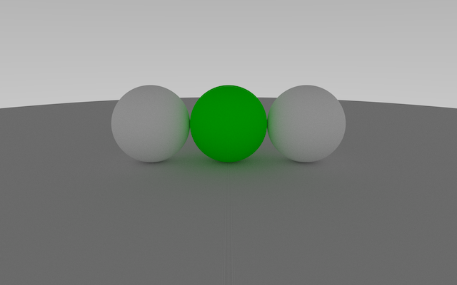

# Path Tracing
[](https://www.codacy.com/app/zerhacken/iq?utm_source=github.com&amp;utm_medium=referral&amp;utm_content=zerhacken/iq&amp;utm_campaign=Badge_Grade) [](https://travis-ci.org/zerhacken/iq) [](https://codecov.io/gh/zerhacken/iq)

fiddlings for recreational digging into global illumination



## Building code

```
git clone https://github.com/zerhacken/iq
mkdir build
cd build
cmake -DCMAKE_BUILD_TYPE=Release ../.
make
```